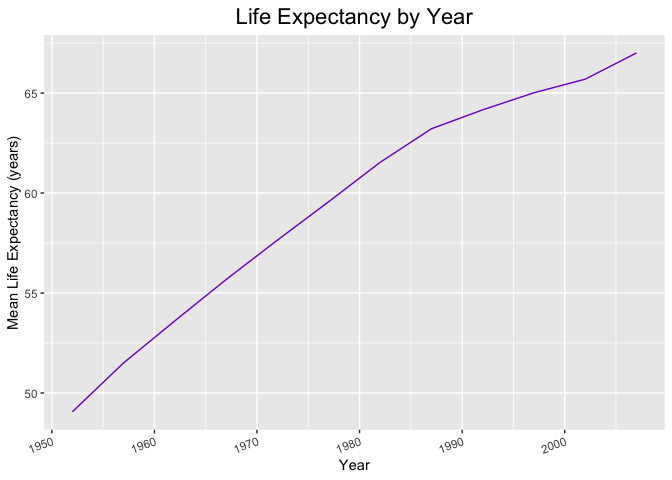
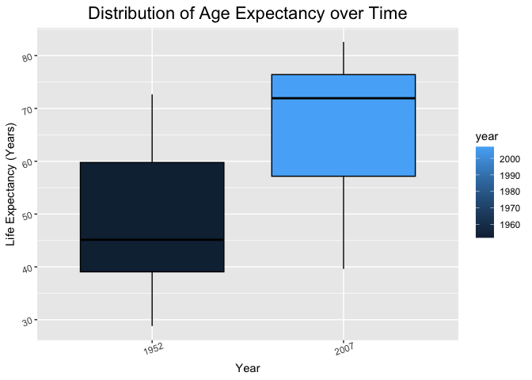
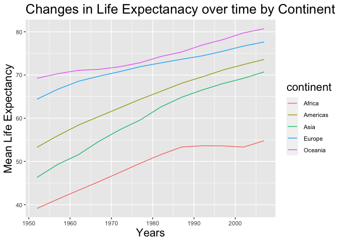
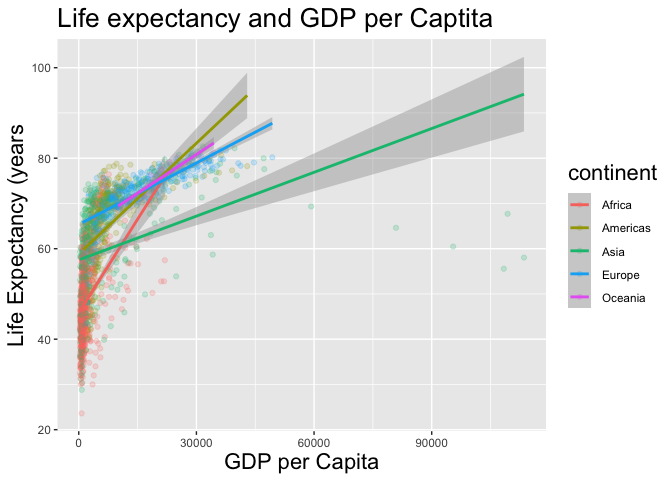
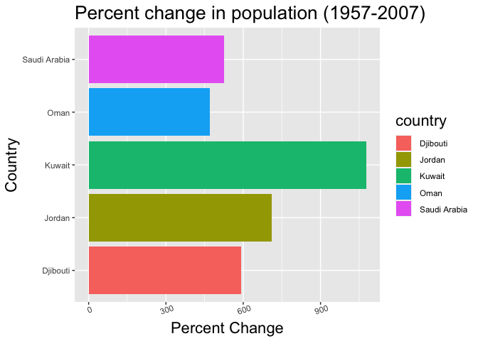
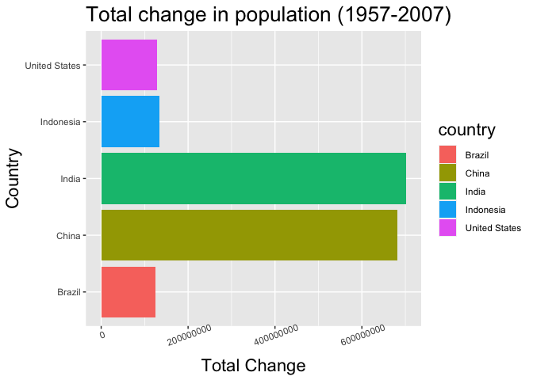
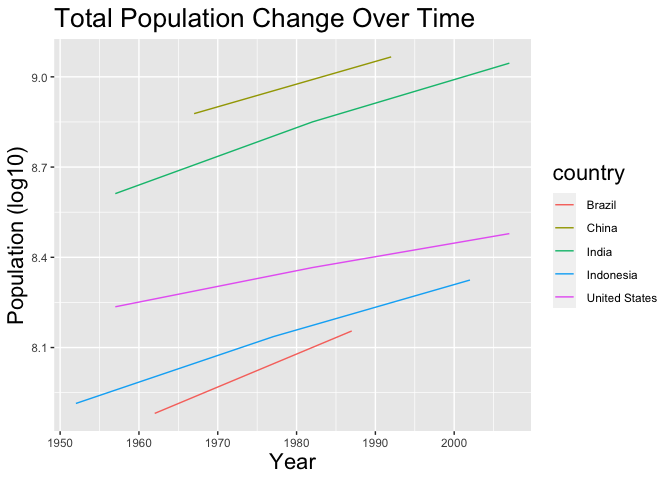
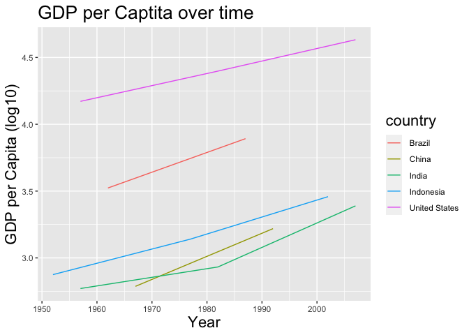
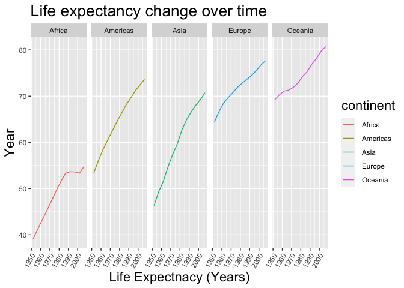

## Instructions
Answer the following questions and complete the exercises in RMarkdown. Please embed all of your code and push your final work to your repository. Your final lab report should be organized, clean, and run free from errors. Remember, you must remove the `#` for the included code chunks to run. Be sure to add your name to the author header above. For any included plots, make sure they are clearly labeled. You are free to use any plot type that you feel best communicates the results of your analysis.  

**In this homework, you should make use of the aesthetics you have learned. It's OK to be flashy!**

Make sure to use the formatting conventions of RMarkdown to make your report neat and clean!  

## Load the libraries

```r
library(tidyverse)
library(janitor)
library(here)
library(naniar)
library(RColorBrewer)
library(paletteer)
```


```r
options(scipen = 999)
```

## Resources
The idea for this assignment came from [Rebecca Barter's](http://www.rebeccabarter.com/blog/2017-11-17-ggplot2_tutorial/) ggplot tutorial so if you get stuck this is a good place to have a look.  

## Gapminder
For this assignment, we are going to use the dataset [gapminder](https://cran.r-project.org/web/packages/gapminder/index.html). Gapminder includes information about economics, population, and life expectancy from countries all over the world. You will need to install it before use. This is the same data that we will use for midterm 2 so this is good practice.

```r
#install.packages("gapminder")
library("gapminder")
```

## Questions
The questions below are open-ended and have many possible solutions. Your approach should, where appropriate, include numerical summaries and visuals. Be creative; assume you are building an analysis that you would ultimately present to an audience of stakeholders. Feel free to try out different `geoms` if they more clearly present your results.  


```r
gapminder <- gapminder
```


**1. Use the function(s) of your choice to get an idea of the overall structure of the data frame, including its dimensions, column names, variable classes, etc. As part of this, determine how NAs are treated in the data.**  


```r
glimpse(gapminder)
```

```
## Rows: 1,704
## Columns: 6
## $ country   <fct> "Afghanistan", "Afghanistan", "Afghanistan", "Afghanistan", …
## $ continent <fct> Asia, Asia, Asia, Asia, Asia, Asia, Asia, Asia, Asia, Asia, …
## $ year      <int> 1952, 1957, 1962, 1967, 1972, 1977, 1982, 1987, 1992, 1997, …
## $ lifeExp   <dbl> 28.801, 30.332, 31.997, 34.020, 36.088, 38.438, 39.854, 40.8…
## $ pop       <int> 8425333, 9240934, 10267083, 11537966, 13079460, 14880372, 12…
## $ gdpPercap <dbl> 779.4453, 820.8530, 853.1007, 836.1971, 739.9811, 786.1134, …
```

```r
head(gapminder)
```

```
## # A tibble: 6 × 6
##   country     continent  year lifeExp      pop gdpPercap
##   <fct>       <fct>     <int>   <dbl>    <int>     <dbl>
## 1 Afghanistan Asia       1952    28.8  8425333      779.
## 2 Afghanistan Asia       1957    30.3  9240934      821.
## 3 Afghanistan Asia       1962    32.0 10267083      853.
## 4 Afghanistan Asia       1967    34.0 11537966      836.
## 5 Afghanistan Asia       1972    36.1 13079460      740.
## 6 Afghanistan Asia       1977    38.4 14880372      786.
```


**2. Among the interesting variables in gapminder is life expectancy. How has global life expectancy changed between 1952 and 2007?**

    Graphical representation of global changes in life expectancy. 

```r
gapminder %>%
  select(lifeExp, year) %>%
  group_by(year) %>%
  summarise(mean_life_exp = mean(lifeExp)) %>%
  ggplot(aes(x= year, y=mean_life_exp)) +
  geom_line( color = "purple3") +
  labs(title = "Life Expectancy by Year",
       x= "Year",
       y= "Mean Life Expectancy (years)") + 
  theme(plot.title = element_text( size = rel(1.5), hjust= 0.5), 
        axis.text.x= element_text(angle= 20, hjust=1))
```

<!-- -->

    The average life expectancy has increase over time.

**3. How do the distributions of life expectancy compare for the years 1952 and 2007?**


```r
gapminder %>%
  select(lifeExp, year) %>%
  group_by(year) %>%
  filter(year == 1952 | year == 2007) %>%
  ggplot(aes(x= as.factor(year), y= lifeExp, group = year, fill = year)) +
  geom_boxplot(color = "black") +
  labs(title = "Distribution of Age Expectancy over Time",
       x = "Year",
       y = "Life Expectancy (Years)") +
  theme(plot.title = element_text(size = rel(1.5), hjust = 0.5),
        axis.text.x = element_text(angle = 20),
        axis.text.y = element_text(angle = 20))
```

<!-- -->

    Life expectancy is higher, on averagem, in 2007 compared to 1952.

**4. Your answer above doesn't tell the whole story since life expectancy varies by region. Make a summary that shows the min, mean, and max life expectancy by continent for all years represented in the data.**


```r
gapminder %>%
  select(lifeExp, year, continent) %>%
  group_by(year, continent) %>%
  select(year, continent, lifeExp) %>%
  summarise(min_life_exp = min(lifeExp),
            mean_life_exp = mean(lifeExp),
            max_life_exp = max(lifeExp))
```

```
## `summarise()` has grouped output by 'year'. You can override using the
## `.groups` argument.
```

```
## # A tibble: 60 × 5
## # Groups:   year [12]
##     year continent min_life_exp mean_life_exp max_life_exp
##    <int> <fct>            <dbl>         <dbl>        <dbl>
##  1  1952 Africa            30            39.1         52.7
##  2  1952 Americas          37.6          53.3         68.8
##  3  1952 Asia              28.8          46.3         65.4
##  4  1952 Europe            43.6          64.4         72.7
##  5  1952 Oceania           69.1          69.3         69.4
##  6  1957 Africa            31.6          41.3         58.1
##  7  1957 Americas          40.7          56.0         70.0
##  8  1957 Asia              30.3          49.3         67.8
##  9  1957 Europe            48.1          66.7         73.5
## 10  1957 Oceania           70.3          70.3         70.3
## # ℹ 50 more rows
```

**5. How has life expectancy changed between 1952-2007 for each continent?**

    This graph shows changes in mean life expecantcy over time, seperatex by continent.

```r
gapminder %>%
  group_by(year, continent) %>%
  summarise(mean_life_exp = mean(lifeExp)) %>%
  ggplot(aes(x= year, y= mean_life_exp, color = continent)) +
  geom_path() + 
  labs(title = "Changes in Life Expectanacy over time by Continent",
       x= "Years",
       y= "Mean Life Expectancy",) +
  theme(title = element_text(size = rel(1.5), hjust = 0.5))
```

```
## `summarise()` has grouped output by 'year'. You can override using the
## `.groups` argument.
```

<!-- -->


**6. We are interested in the relationship between per capita GDP and life expectancy; i.e. does having more money help you live longer?**


```r
gapminder %>%
  select(gdpPercap, lifeExp, continent) %>%
  ggplot(aes(x = gdpPercap, y= lifeExp, color = continent)) + 
  geom_point(alpha= 0.2) + 
  geom_smooth(method = lm, se = T) +
  labs(title = "Life expectancy and GDP per Captita",
       x= "GDP per Capita",
       y= "Life Expectancy (years") +
  theme(title = element_text(size = rel(1.5), hjust = 0.5))
```

```
## `geom_smooth()` using formula = 'y ~ x'
```

<!-- -->

    In all continents, a country having a higher GDP per Capita is associated with higher life expectancies.  

**7. Which countries have had the largest population growth since 1952?**

    Based on percent change

```r
gapminder %>%
  filter(year == 1957 | year == 2007) %>%
  select(country, year, pop) %>%
  pivot_wider(names_from = year, values_from = pop) %>%
  mutate(percent_change = ((`2007` - `1957`) / `1957`) * 100) %>%
  top_n(5, percent_change) %>%
  ggplot(aes(x=country, y= percent_change, fill= country)) + 
  geom_col() + 
  coord_flip() +
  labs(title = "Percent change in population (1957-2007)", 
       x= "Country",
       y = "Percent Change") + 
  theme(title = element_text(size = rel(1.5), hjust= (0.5)),
        axis.text.x = element_text(angle = 20))
```

<!-- -->


    Based on total population change

```r
gapminder %>%
  filter(year == 1957 | year == 2007) %>%
  select(country, year, pop) %>%
  pivot_wider(names_from = year, values_from = pop) %>%
  mutate(total_change = (`2007` - `1957`)) %>%
  top_n(5, total_change) %>%
  ggplot(aes(x=country, y= total_change, fill= country)) + 
  geom_col() + 
  coord_flip() +
  labs(title = "Total change in population (1957-2007)", 
       x= "Country",
       y = "Total Change") + 
  theme(title = element_text(size = rel(1.5), hjust= (0.5)),
        axis.text.x = element_text(angle = 20)) 
```

<!-- -->

**8. Use your results from the question above to plot population growth for the top five countries since 1952.**

    I chose to use the total change in population over the percent change in population for my final plot.  
    Raw data used to find largest changes in population.

```r
gapminder %>%
  filter(year == 1957 | year == 2007) %>%
  select(country, year, pop) %>%
  pivot_wider(names_from = year, values_from = pop) %>%
  mutate(total_change = (`2007` - `1957`)) %>%
  top_n(5, total_change) %>%
  arrange(-total_change)
```

```
## # A tibble: 5 × 4
##   country          `1957`     `2007` total_change
##   <fct>             <int>      <int>        <int>
## 1 India         409000000 1110396331    701396331
## 2 China         637408000 1318683096    681275096
## 3 Indonesia      90124000  223547000    133423000
## 4 United States 171984000  301139947    129155947
## 5 Brazil         65551171  190010647    124459476
```

    Graphical representation of the changes in population of these 5 countries over time.

```r
gapminder %>%
  filter(country == c("Brazil", "China", "India", "Indonesia", "United States")) %>%
  select(country, year, pop) %>%
  ggplot(aes(x=year, y= log10(pop), color = country)) + 
  geom_path() +
  labs(title = "Total Population Change Over Time", 
       x= "Year", 
       y= "Population (log10)") +
  theme(title = element_text(size= rel(1.5), hjust= 0.5))
```

```
## Warning: There were 2 warnings in `filter()`.
## The first warning was:
## ℹ In argument: `country == c("Brazil", "China", "India", "Indonesia", "United
##   States")`.
## Caused by warning in `==.default`:
## ! longer object length is not a multiple of shorter object length
## ℹ Run `dplyr::last_dplyr_warnings()` to see the 1 remaining warning.
```

<!-- -->

    It would appear there is some population data missing from these countires over the specified time frames.

**9. How does per capita GDP growth compare between these same five countries?**

    I plotted GDP over time and colored by Country.

```r
gapminder %>%
  filter(country == c("Brazil", "China", "India", "Indonesia", "United States")) %>%
  select(gdpPercap, year, country) %>%
  ggplot(aes(x= year, y= log10(gdpPercap), color = country)) + 
  geom_line() + 
  labs(title = "GDP per Captita over time", 
       x= "Year", 
       y= "GDP per Capita (log10)") +
  theme(title = element_text(size= rel(1.5), hjust= 0.5))
```

```
## Warning: There were 2 warnings in `filter()`.
## The first warning was:
## ℹ In argument: `country == c("Brazil", "China", "India", "Indonesia", "United
##   States")`.
## Caused by warning in `==.default`:
## ! longer object length is not a multiple of shorter object length
## ℹ Run `dplyr::last_dplyr_warnings()` to see the 1 remaining warning.
```

<!-- -->

**10. Make one plot of your choice that uses faceting!**

    I plotted the change in mean life expectancy over time and faceted by continent.

```r
gapminder %>%
  group_by(year, continent) %>%
  summarise(mean_life_exp = mean(lifeExp)) %>%
  ggplot(aes(x= year, y= mean_life_exp, color = continent)) + 
  geom_line() + 
  facet_grid(~continent) +
  labs(title = "Life expectancy change over time", 
       x= "Life Expectnacy (Years)", 
       y= "Year") +
  theme(title = element_text(size= rel(1.5), hjust= 0.5),
        axis.text.x = element_text(angle=60, hjust=1))
```

```
## `summarise()` has grouped output by 'year'. You can override using the
## `.groups` argument.
```

<!-- -->

    All continents have seen an increase in life expectancy over time, but some did increase more than others.
    
## Push your final code to GitHub!
Please be sure that you check the `keep md` file in the knit preferences. 
