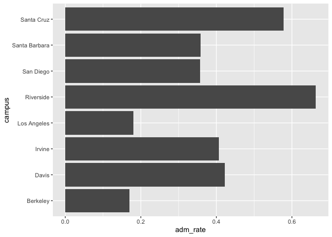

## Instructions
Answer the following questions and complete the exercises in RMarkdown. Please embed all of your code and push your final work to your repository. Your final lab report should be organized, clean, and run free from errors. Remember, you must remove the `#` for the included code chunks to run. Be sure to add your name to the author header above.  

Make sure to use the formatting conventions of RMarkdown to make your report neat and clean!  

## Load the libraries

```r
library(tidyverse)
library(janitor)
library(here)
library(naniar)
library(ggplot2)
```

For this homework, we will take a departure from biological data and use data about California colleges. These data are a subset of the national college scorecard (https://collegescorecard.ed.gov/data/). Load the `ca_college_data.csv` as a new object called `colleges`.

```r
ca_colleges <- read_csv("ca_college_data.csv") %>% clean_names()
```

```
## Rows: 341 Columns: 10
## ── Column specification ────────────────────────────────────────────────────────
## Delimiter: ","
## chr (4): INSTNM, CITY, STABBR, ZIP
## dbl (6): ADM_RATE, SAT_AVG, PCIP26, COSTT4_A, C150_4_POOLED, PFTFTUG1_EF
## 
## ℹ Use `spec()` to retrieve the full column specification for this data.
## ℹ Specify the column types or set `show_col_types = FALSE` to quiet this message.
```

The variables are a bit hard to decipher, here is a key:  

INSTNM: Institution name  
CITY: California city  
STABBR: Location state  
ZIP: Zip code  
ADM_RATE: Admission rate  
SAT_AVG: SAT average score  
PCIP26: Percentage of degrees awarded in Biological And Biomedical Sciences  
COSTT4_A: Annual cost of attendance  
C150_4_POOLED: 4-year completion rate  
PFTFTUG1_EF: Percentage of undergraduate students who are first-time, full-time degree/certificate-seeking undergraduate students  

1. Use your preferred function(s) to have a look at the data and get an idea of its structure. Make sure you summarize NA's and determine whether or not the data are tidy. You may also consider dealing with any naming issues.

```r
glimpse(ca_colleges)
```

```
## Rows: 341
## Columns: 10
## $ instnm        <chr> "Grossmont College", "College of the Sequoias", "College…
## $ city          <chr> "El Cajon", "Visalia", "San Mateo", "Ventura", "Oxnard",…
## $ stabbr        <chr> "CA", "CA", "CA", "CA", "CA", "CA", "CA", "CA", "CA", "C…
## $ zip           <chr> "92020-1799", "93277-2214", "94402-3784", "93003-3872", …
## $ adm_rate      <dbl> NA, NA, NA, NA, NA, NA, NA, NA, NA, NA, NA, NA, NA, NA, …
## $ sat_avg       <dbl> NA, NA, NA, NA, NA, NA, NA, NA, NA, NA, NA, NA, NA, NA, …
## $ pcip26        <dbl> 0.0016, 0.0066, 0.0038, 0.0035, 0.0085, 0.0151, 0.0000, …
## $ costt4_a      <dbl> 7956, 8109, 8278, 8407, 8516, 8577, 8580, 9181, 9281, 93…
## $ c150_4_pooled <dbl> NA, NA, NA, NA, NA, NA, 0.2334, NA, NA, NA, NA, 0.1704, …
## $ pftftug1_ef   <dbl> 0.3546, 0.5413, 0.3567, 0.3824, 0.2753, 0.4286, 0.2307, …
```

```r
head(ca_colleges)
```

```
## # A tibble: 6 × 10
##   instnm       city  stabbr zip   adm_rate sat_avg pcip26 costt4_a c150_4_pooled
##   <chr>        <chr> <chr>  <chr>    <dbl>   <dbl>  <dbl>    <dbl>         <dbl>
## 1 Grossmont C… El C… CA     9202…       NA      NA 0.0016     7956            NA
## 2 College of … Visa… CA     9327…       NA      NA 0.0066     8109            NA
## 3 College of … San … CA     9440…       NA      NA 0.0038     8278            NA
## 4 Ventura Col… Vent… CA     9300…       NA      NA 0.0035     8407            NA
## 5 Oxnard Coll… Oxna… CA     9303…       NA      NA 0.0085     8516            NA
## 6 Moorpark Co… Moor… CA     9302…       NA      NA 0.0151     8577            NA
## # ℹ 1 more variable: pftftug1_ef <dbl>
```


2. Which cities in California have the highest number of colleges?

```r
ca_colleges %>%
  group_by(city) %>%
  summarise(number_college = n_distinct(instnm)) %>%
  arrange(-number_college)
```

```
## # A tibble: 161 × 2
##    city          number_college
##    <chr>                  <int>
##  1 Los Angeles               24
##  2 San Diego                 18
##  3 San Francisco             15
##  4 Sacramento                10
##  5 Berkeley                   9
##  6 Oakland                    9
##  7 Claremont                  7
##  8 Pasadena                   6
##  9 Fresno                     5
## 10 Irvine                     5
## # ℹ 151 more rows
```


3. Based on your answer to #2, make a plot that shows the number of colleges in the top 10 cities.

```r
ca_colleges %>%
  group_by(city) %>%
  summarise(number_college = n_distinct(instnm)) %>%
  top_n(10, number_college) %>%
  ggplot(aes(x=city, y=number_college)) + 
  geom_col() + 
  coord_flip()
```

<!-- -->


4. The column `COSTT4_A` is the annual cost of each institution. Which city has the highest average cost? Where is it located?


```r
ca_colleges %>%
  group_by(city) %>%
  summarise(avg_cost = mean(costt4_a))%>%
  top_n(5, avg_cost) %>%
  arrange(-avg_cost)
```

```
## # A tibble: 5 × 2
##   city     avg_cost
##   <chr>       <dbl>
## 1 Malibu      66152
## 2 Valencia    64686
## 3 Redlands    61542
## 4 Moraga      61095
## 5 Atherton    56035
```


```r
ca_colleges %>%
  group_by(city) %>%
  summarise(avg_cost = mean(costt4_a))%>%
  top_n(5, avg_cost) %>%
  ggplot(aes(x=city, y=avg_cost)) + 
  geom_col() + 
  coord_flip()
```

<!-- -->
    
    The city with the highest cost of attendence is Malibu, with $66,152
    
5. Based on your answer to #4, make a plot that compares the cost of the individual colleges in the most expensive city. Bonus! Add UC Davis here to see how it compares :>).  

  The numbers

```r
ca_colleges %>% 
  filter(city == "Malibu" | instnm == "University of California-Davis") %>% 
  select(instnm, costt4_a) %>%
  arrange(-costt4_a)
```

```
## # A tibble: 2 × 2
##   instnm                         costt4_a
##   <chr>                             <dbl>
## 1 Pepperdine University             66152
## 2 University of California-Davis    33904
```

    The plot

```r
ca_colleges %>% 
  filter(city == "Malibu" | instnm == "University of California-Davis") %>% 
  select(instnm, costt4_a) %>%
  ggplot(aes(x=costt4_a, y=instnm)) +
  geom_col()
```

<!-- -->
    
6. The column `ADM_RATE` is the admissions rate by college and `C150_4_POOLED` is the four-year completion rate. Use a scatterplot to show the relationship between these two variables. What do you think this means?  


```r
ca_colleges %>%
  ggplot(aes(x=adm_rate, y=c150_4_pooled)) + 
  geom_point() +
  geom_smooth(method = lm, se=T)
```

```
## `geom_smooth()` using formula = 'y ~ x'
```

```
## Warning: Removed 251 rows containing non-finite values (`stat_smooth()`).
```

```
## Warning: Removed 251 rows containing missing values (`geom_point()`).
```

<!-- -->

    Admissions rates seems to have a negative correlation with graduation rate.  
    
7. Is there a relationship between cost and four-year completion rate? (You don't need to do the stats, just produce a plot). What do you think this means?  


```r
ca_colleges %>%
  ggplot(aes(x=costt4_a, y=c150_4_pooled)) +
  geom_point() + 
  geom_smooth(method= lm, se=T)
```

```
## `geom_smooth()` using formula = 'y ~ x'
```

```
## Warning: Removed 225 rows containing non-finite values (`stat_smooth()`).
```

```
## Warning: Removed 225 rows containing missing values (`geom_point()`).
```

<!-- -->

    There is a positive correlation between cost of attendance and 4-year graduation rate.

8. The column titled `INSTNM` is the institution name. We are only interested in the University of California colleges. Make a new data frame that is restricted to UC institutions. You can remove `Hastings College of Law` and `UC San Francisco` as we are only interested in undergraduate institutions.


```r
univ_calif_final <- ca_colleges %>%
  filter(str_detect(instnm, "University of California") & !str_detect(instnm, "San Francisco") & !str_detect(instnm, "Hastings"))
```

Remove `Hastings College of Law` and `UC San Francisco` and store the final data frame as a new object `univ_calif_final`.

Use `separate()` to separate institution name into two new columns "UNIV" and "CAMPUS".


```r
univ_calif_final <-  univ_calif_final %>%
  separate(col = instnm,
           into = c("univ", "campus" ),
           sep = "-")
```

9. The column `ADM_RATE` is the admissions rate by campus. Which UC has the lowest and highest admissions rates? Produce a numerical summary and an appropriate plot.  
    
    The summary

```r
univ_calif_final %>%
  select(campus, adm_rate) %>%
  arrange(adm_rate)
```

```
## # A tibble: 8 × 2
##   campus        adm_rate
##   <chr>            <dbl>
## 1 Berkeley         0.169
## 2 Los Angeles      0.180
## 3 San Diego        0.357
## 4 Santa Barbara    0.358
## 5 Irvine           0.406
## 6 Davis            0.423
## 7 Santa Cruz       0.578
## 8 Riverside        0.663
```

    The plot

```r
univ_calif_final %>%
  ggplot(aes(x=adm_rate, y=campus)) + 
  geom_col()
```

<!-- -->

    UC Berkeley has the lowest admission rate. 

10. If you wanted to get a degree in biological or biomedical sciences, which campus confers the majority of these degrees? Produce a numerical summary and an appropriate plot (PCIP26).

    The data

```r
univ_calif_final %>%
  select(campus, pcip26) %>%
  arrange(-pcip26)
```

```
## # A tibble: 8 × 2
##   campus        pcip26
##   <chr>          <dbl>
## 1 San Diego      0.216
## 2 Davis          0.198
## 3 Santa Cruz     0.193
## 4 Los Angeles    0.155
## 5 Riverside      0.149
## 6 Santa Barbara  0.108
## 7 Irvine         0.107
## 8 Berkeley       0.105
```

    The plot

```r
univ_calif_final %>%
  ggplot(aes(x=pcip26, y=campus)) +
  geom_col()
```

<!-- -->
    
## Knit Your Output and Post to [GitHub](https://github.com/FRS417-DataScienceBiologists)
