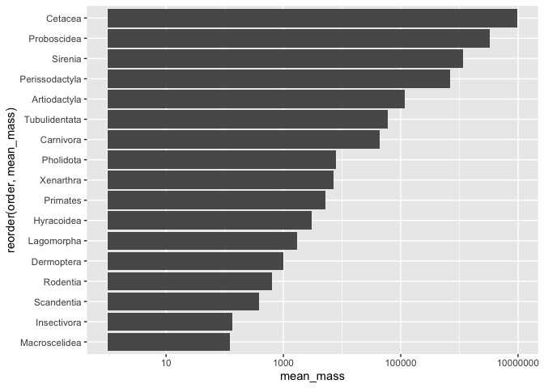
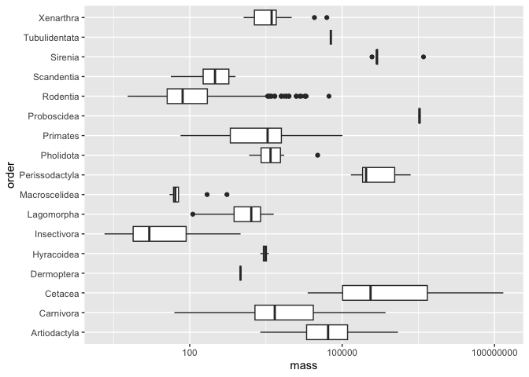

## Learning Goals
*At the end of this exercise, you will be able to:*    
1. Produce box plots using `ggplot.`  
2. Customize labels on axes using `labs` and `themes`.  
3. Use `color`, `fill`, and `group` to customize plots and improve aesthetics.  

## Review
Now that you have been introduced to `ggplot`, let's review the plot types from last week and learn how to manipulate their aesthetics to better suit our needs. Aesthetics make a significant visual difference, but you can take it too far so remember that the goal is to produce clean plots that are not distracting.  

## Resources
- [ggplot2 cheatsheet](https://www.rstudio.com/wp-content/uploads/2015/03/ggplot2-cheatsheet.pdf)
- [`ggplot` themes](https://ggplot2.tidyverse.org/reference/ggtheme.html)
- [Rebecca Barter `ggplot` Tutorial](http://www.rebeccabarter.com/blog/2017-11-17-ggplot2_tutorial/)

## Load the libraries

```r
library("tidyverse")
library("janitor")
library(ggplot2)
```

## Load the data
Let's revisit the mammal life history data to practice our ggplot skills. The [data](http://esapubs.org/archive/ecol/E084/093/) are from: *S. K. Morgan Ernest. 2003. Life history characteristics of placental non-volant mammals. Ecology 84:3402.*

```r
life_history <- read_csv("data/mammal_lifehistories_v2.csv", na="-999") %>% clean_names()
```

## Bar Plots
Bar plots count the number of observations in a categorical variable. What is the difference between `geom_bar` and `geom_col`? Make two bar plots showing the number of observations for each order using each geom type.

`geom_col`

```r
life_history %>%
  count(order, sort=T)%>%
  ggplot(aes(x=n, y=order)) +
  geom_col()
```

<!-- -->

`geom_bar`

```r
life_history %>%
  ggplot(aes(order)) +
  geom_bar() +
  coord_flip()
```

<!-- -->

Remember that ggplot build plots in layers. These layers can significantly improve the appearance of the plot. What if we wanted a bar plot of the mean mass for each order? Would we use `geom_bar` or `geom_col`?  

```r
life_history %>%
  group_by(order) %>%
  summarise(mean_mass = mean(mass, na.rm=T)) %>%
  ggplot(aes(x=order, y=mean_mass)) +
  geom_col() +
  coord_flip() +
  scale_y_log10()
```

<!-- -->

There are a few problems here. First, the y-axis is in scientific notation. We can fix this by adjusting the options for the session.

```r
options(scipen=999)#cancels scientific notation for the session
```

Next, the y-axis is not on a log scale. We can fix this by adding `scale_y_log10()`.

```r
life_history %>%
  group_by(order) %>%
  summarise(mean_mass = mean(mass, na.rm=T)) %>%
  ggplot(aes(x=order, y=mean_mass)) +
  geom_col() +
  coord_flip() +
  scale_y_log10()
```

<!-- -->

Lastly, we can adjust the x-axis labels to make them more readable. We do this using `reorder`.

```r
life_history %>%
  group_by(order) %>%
  summarise(mean_mass = mean(mass, na.rm=T)) %>%
  ggplot(aes(x=reorder(order, mean_mass), y=mean_mass)) + # allows us to reorder x-axis by mean mass
  geom_col() +
  coord_flip() +
  scale_y_log10()
```

<!-- -->

## Scatterplots
Scatter plots allow for comparisons of two continuous variables. Make a scatterplot below that compares gestation time and weaning mass.

```r
life_history %>%
  ggplot(aes(x=gestation, y=wean_mass)) +
  geom_jitter(na.rm= T) + #prevents overplotting
  scale_y_log10()
```

<!-- -->

## Boxplots
Box plots help us visualize a range of values. So, on the x-axis we typically have something categorical and the y-axis is the range. Let's make a box plot that compares mass across taxonomic orders.

```r
life_history %>%
  group_by(order) %>%
  ggplot(aes(x=mass, y=order)) + 
  geom_boxplot() +
  scale_x_log10()
```

```
## Warning: Removed 85 rows containing non-finite values (`stat_boxplot()`).
```

<!-- -->


## Aesthetics: Labels
Now that we have practiced scatter plots, bar plots, and box plots we need to learn how to adjust their appearance to suit our needs. Let's start with labeling x and y axes.  

For this exercise, let's use the `ElephantsMF` data. These data are from Phyllis Lee, Stirling University, and are related to Lee, P., et al. (2013), "Enduring consequences of early experiences: 40-year effects on survival and success among African elephants (Loxodonta africana)," Biology Letters, 9: 20130011. [kaggle](https://www.kaggle.com/mostafaelseidy/elephantsmf).

```r
elephants <- read_csv("data/elephantsMF.csv") %>% clean_names()
```

```
## Rows: 288 Columns: 3
## ── Column specification ────────────────────────────────────────────────────────
## Delimiter: ","
## chr (1): Sex
## dbl (2): Age, Height
## 
## ℹ Use `spec()` to retrieve the full column specification for this data.
## ℹ Specify the column types or set `show_col_types = FALSE` to quiet this message.
```

```r
names(elephants)
```

```
## [1] "age"    "height" "sex"
```

Make a plot that compares age and height of elephants.

```r
elephants %>%
  ggplot(aes(x=age, y=height)) +
  geom_point() +
  geom_smooth(method=lm, se=T)
```

```
## `geom_smooth()` using formula = 'y ~ x'
```

<!-- -->

The plot looks clean, but it is incomplete. A reader unfamiliar with the data might have a difficult time interpreting the labels. To add custom labels, we use the `labs` command.

```r
elephants %>% 
  ggplot(aes(x=age, y=height)) + 
  geom_point() + 
  geom_smooth(method=lm, se=F)+
  labs(title="Elephant Age vs. Height",
       x="Age (years)",
       y="Height (cm)") 
```

```
## `geom_smooth()` using formula = 'y ~ x'
```

<!-- -->

```r
# Adds titles 
```

We can improve the plot further by adjusting the size and face of the text. We do this using `theme()`. The `rel()` option changes the relative size of the title to keep things consistent. Adding `hjust` allows control of title position.

```r
elephants %>% 
  ggplot(aes(x=age, y=height)) + 
  geom_point() + 
  geom_smooth(method=lm, se=T)+
  labs(title="Elephant Age vs. Height",
       x="Age (years)",
       y="Height (cm)") +
  theme(plot.title = element_text(size=rel(1.4), hjust = 0.5)) #1.5 times bigger relative to x-y axis, hjust is for title position
```

```
## `geom_smooth()` using formula = 'y ~ x'
```

<!-- -->

## Other Aesthetics
There are lots of options for aesthetics. An aesthetic can be assigned to either numeric or categorical data. `fill` is a common grouping option; notice that an appropriate key is displayed when you use one of these options.

```r
elephants %>% 
  ggplot(aes(x=sex, fill=sex))+ #fill is an option that auto-assigns colors
  geom_bar()
```

<!-- -->

`size` adjusts the size of points relative to a continuous variable.

```r
life_history %>% 
  ggplot(aes(x=gestation, y=log10(mass), size=mass))+ #allows for incorpration of a 3rd vairable , can nest "scale_y_log10"command into the aes() part of setup
  geom_point(na.rm=T)
```

<!-- -->
## That's it! Let's take a break and then move on to part 2!  

-->[Home](https://jmledford3115.github.io/datascibiol/)
