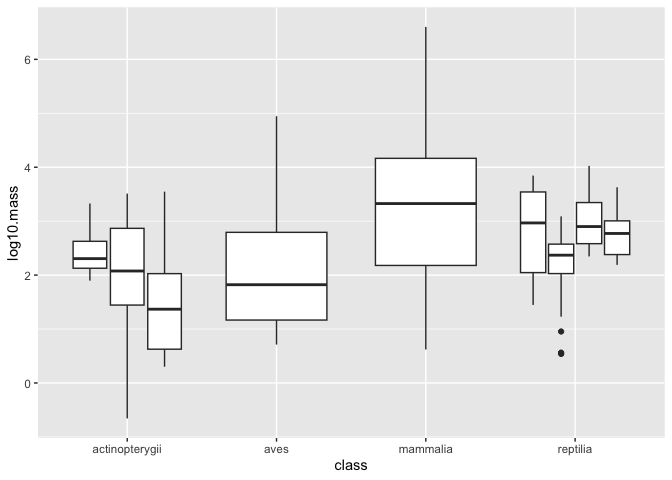

## Learning Goals
*At the end of this exercise, you will be able to:*    
1. Build stacked bar plots of categorical variables.  
2. Build side-by-side barplots using `position= "dodge"`.  

## Resources
- [ggplot2 cheatsheet](https://www.rstudio.com/wp-content/uploads/2015/03/ggplot2-cheatsheet.pdf)

## Load the libraries

```r
library(tidyverse)
library(janitor)
library(palmerpenguins)
```


```r
options(scipen=999) #cancels the use of scientific notation for the session
```

## Data
**Database of vertebrate home range sizes.**  
Reference: Tamburello N, Cote IM, Dulvy NK (2015) Energy and the scaling of animal space use. The American Naturalist 186(2):196-211. http://dx.doi.org/10.1086/682070.  
Data: http://datadryad.org/resource/doi:10.5061/dryad.q5j65/1  

```r
homerange <- 
  read_csv("data/Tamburelloetal_HomeRangeDatabase.csv", na = c("", "NA", "\\"))
```

```
## Rows: 569 Columns: 24
## ── Column specification ────────────────────────────────────────────────────────
## Delimiter: ","
## chr (16): taxon, common.name, class, order, family, genus, species, primarym...
## dbl  (8): mean.mass.g, log10.mass, mean.hra.m2, log10.hra, dimension, preyma...
## 
## ℹ Use `spec()` to retrieve the full column specification for this data.
## ℹ Specify the column types or set `show_col_types = FALSE` to quiet this message.
```

## A few more useful aesthetics
There are many options to create nice plots in ggplot. One useful trick is to store the plot as a new object and then experiment with geom's and aesthetics. Let's setup a plot that compares `log10.mass` and `log10.hra.` Notice that we are not specifying a geom.

```r
p <- homerange %>% 
  ggplot(aes(x= log10.mass, y= log10.hra)) #store base plot as an object to make layering easier
```

Play with point size by adjusting the `size` argument.

```r
p + geom_point(size=1.25)
```

<!-- -->

We can color the points by a categorical variable.

```r
p + geom_point(aes(color=thermoregulation))
```

<!-- -->

We can also map shapes to another categorical variable.

```r
p + geom_point(aes(color=thermoregulation, shape=thermoregulation))
```

<!-- -->

## Barplots and multiple variables
At this point you should be comfortable building bar plots that show counts of observations using `geom_bar()`. Last time we explored the `fill` option as a way to bring color to the plot; i.e. we filled by the same variable that we were plotting. What happens when we fill by a different categorical variable?  
Let's start by counting how many observations we have in each taxonomic group.

```r
homerange %>% count(taxon, sort=T)
```

```
## # A tibble: 9 × 2
##   taxon             n
##   <chr>         <int>
## 1 mammals         238
## 2 birds           140
## 3 marine fishes    90
## 4 snakes           41
## 5 river fishes     14
## 6 turtles          14
## 7 tortoises        12
## 8 lizards          11
## 9 lake fishes       9
```

Now let's make a bar plot of these data.

```r
homerange %>% 
  ggplot(aes(taxon)) +
  geom_bar()
```

<!-- -->

By specifying `fill=trophic.guild` we build a stacked bar plot that shows the proportion of a given taxonomic group that is an herbivore or carnivore.

```r
homerange %>%
  ggplot(aes(taxon, fill=trophic.guild)) + 
  geom_bar() +
  coord_flip() +
  labs(title = "Observations by Taxon")
```

<!-- -->

We can also have counts of each trophic guild within taxonomic group shown side-by-side by specifying `position="dodge"`.

```r
homerange %>%
  ggplot(aes(taxon, fill=trophic.guild)) + 
  geom_bar(position = "dodge") +
  coord_flip() +
  labs(title = "Observations by Taxon")
```

<!-- -->

Here is the same plot oriented vertically.

```r
homerange %>%
  ggplot(aes(taxon, fill=trophic.guild)) + 
  geom_bar(position = "dodge") +
  theme(axis.text = element_text(angle = 20))
```

<!-- -->

```r
  labs(title = "Observations by Taxon")
```

```
## $title
## [1] "Observations by Taxon"
## 
## attr(,"class")
## [1] "labels"
```

We can also scale all bars to a percentage.

```r
homerange %>% 
  ggplot(aes(taxon, fill = trophic.guild))+
  geom_bar(position = position_fill())+ 
  scale_y_continuous(labels = scales::percent)+
  coord_flip()
```

<!-- -->

## Practice
For this practice, let's use the [palmerpenguins](https://allisonhorst.github.io/palmerpenguins/articles/intro.html) data.  

1. Make a bar plot that shows counts of individuals by island. Fill by species, and try both a stacked bar plot and `position="dodge"`.

```r
library(palmerpenguins)
penguins <- penguins
```


```r
penguins %>%
  ggplot(aes(island, fill=species)) + 
  geom_bar()
```

<!-- -->


```r
penguins %>%
  ggplot(aes(island, fill=species)) + 
  geom_bar(position = "dodge")  
```

<!-- -->

2. Make another bar plot that shows the number of individuals by sex on each island?

```r
penguins %>%
  filter(sex != "na") %>%
  ggplot(aes(island, fill=sex)) +
  geom_bar(position = "dodge")
```

<!-- -->

## Using `group`
In addition to `fill`, `group` is an aesthetic that accomplishes the same function but does not add color.

Here is a box plot that shows `log10.mass` by taxonomic `class.`

```r
homerange %>% 
  ggplot(aes(x = class, y = log10.mass)) +
  geom_boxplot()
```

<!-- -->

I use `group` to make individual box plots for each taxon within class.

```r
homerange %>% 
  ggplot(aes(x = class, y = log10.mass, group = taxon)) + #group can split further 
  geom_boxplot()
```

<!-- -->

I can also use `fill` to associate the different taxa with a color coded key.

```r
homerange %>%
  ggplot(aes(x= class, y= log10.mass, group = taxon, fill= taxon)) +
  geom_boxplot(alpha= 0.4) #edits transparency
```

<!-- -->

## Wrap-up  
Please review the learning goals and be sure to use the code here as a reference when completing the homework.    
-->[Home](https://jmledford3115.github.io/datascibiol/)
